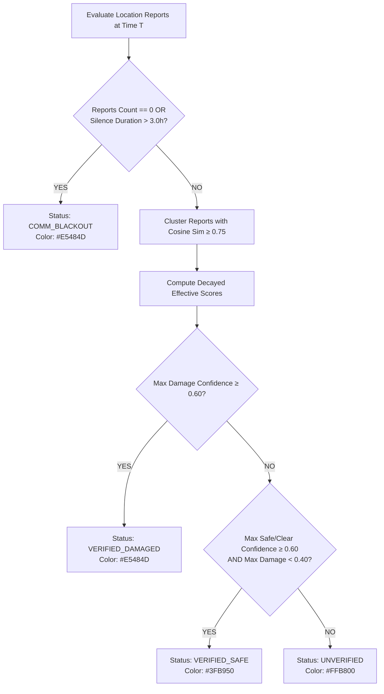

<div align="center">

# 🌫️ POST-DISASTER // INFORMATION FOG
### Real-Time Disaster Situational Awareness, Incident Deduplication & Population Accountability

**A command-center prototype for resolving information asymmetry, deduplicating multi-source disaster reports, calculating transparent reliability scores with staleness decay, and identifying communication blackouts during the critical first 24 hours post-disaster.**

---

[](https://python.org)
[](https://fastapi.tiangolo.com)
[](https://nextjs.org)
[](https://typescriptlang.org)
[](https://tailwindcss.com)
[](https://huggingface.co/sentence-transformers/all-MiniLM-L6-v2)
[](https://pytest.org)

</div>

---

## ⚡ Quick Start: How to Run (Step-by-Step)

To run the full **Post-Disaster Information Fog** system, you need **two terminal tabs**:

### 1️⃣ Terminal 1: Start the AI + FastAPI Backend
```bash
# 1. Install Python dependencies (Python 3.11 recommended)
pip install -r requirements.txt

# 2. Launch the FastAPI server on port 8000
python -m uvicorn app.main:app --reload --port 8000
```
- **Backend API Root**: [http://localhost:8000](http://localhost:8000)
- **Interactive Swagger Docs**: [http://localhost:8000/docs](http://localhost:8000/docs)
- **ReDoc Documentation**: [http://localhost:8000/redoc](http://localhost:8000/redoc)

> [!NOTE]
> On startup, the backend automatically initializes SQLite (`disaster_fog.db`), pre-seeds ~280 synthetic reports across the 24-hour disaster window, and pre-warms the `sentence-transformers/all-MiniLM-L6-v2` embedding model.

---

### 2️⃣ Terminal 2: Start the Next.js Frontend
```bash
# 1. Navigate into the frontend folder
cd frontend

# 2. Install Node packages (first time only)
npm install

# 3. Start the Next.js development server on port 3000
npm run dev -- --port 3000
```
- **Live Command-Center Dashboard**: [http://localhost:3000](http://localhost:3000)

---

### 3️⃣ Running Automated Tests
```bash
# Run the complete test suite (26 unit and API integration tests)
python -m pytest -v
```

---

### ⚠️ Troubleshooting Port Conflicts (`[WinError 10013]`)
If you see `[WinError 10013] An attempt was made to access a socket in a way forbidden by its access permissions`, it means a previous process is already occupying port `8000` or `3000`.
- To identify and stop the process on Windows PowerShell:
  ```powershell
  # Check what is using port 8000
  Get-NetTCPConnection -LocalPort 8000 -ErrorAction SilentlyContinue | Select-Object OwningProcess
  
  # Or run on an alternate port:
  python -m uvicorn app.main:app --reload --port 8080
  ```

---

## 📑 Table of Contents

1. [Quick Start: How to Run](#-quick-start-how-to-run-step-by-step)
2. [Executive Summary & Problem Space](#-executive-summary--problem-space)
3. [Key Capabilities & Architectural Thesis](#-key-capabilities--architectural-thesis)
4. [System Architecture](#-system-architecture)
5. [AI Pipeline & Mathematical Formulations](#-ai-pipeline--mathematical-formulations)
   - [1. Ingestion & Extraction](#1-ingestion--extraction)
   - [2. Dense Embedding & Incident Deduplication](#2-dense-embedding--incident-deduplication)
   - [3. Transparent Reliability Scoring](#3-transparent-reliability-scoring)
   - [4. Exponential Staleness Decay](#4-exponential-staleness-decay)
   - [5. Situational Status State Machine](#5-situational-status-state-machine)
6. [Fixed 8-Location Central Nepal Gazetteer](#-fixed-8-location-central-nepal-gazetteer)
7. [Simulation Replay Clock & Synthetic Dataset](#-simulation-replay-clock--synthetic-dataset)
8. [Brutalist Command-Center Frontend](#-brutalist-command-center-frontend)
9. [API Contract & Integration Reference](#-api-contract--integration-reference)
10. [Getting Started & Installation Guide](#-getting-started--installation-guide)
11. [Automated Verification & Testing](#-automated-verification--testing)
12. [Project Directory Tree](#-project-directory-tree)

---

## 🚨 Executive Summary & Problem Space

In the first **24 hours** following a major natural disaster (such as a high-magnitude earthquake or flash flood), emergency command centers face severe **information fog**:
- **Information Fragmentation**: Hundreds of reports pour in from unvetted citizen calls, police radios, hospital triage desks, and social media feeds.
- **Redundancy & Duplication**: 15 different witnesses report the same collapsed bridge with slightly differing wording, inflating perceived incident counts.
- **Contradictory Telemetry**: Social media claims "100 dead" while hospital triage logs confirm "3 dead and 14 injured."
- **Communication Blackouts**: Remote mountain districts go completely silent due to fallen transmission towers and collapsed infrastructure. A lack of incoming reports is frequently misinterpreted as "no damage," when in reality it represents a severe crisis.

### The Solution
The **Post-Disaster Information Fog** system is an end-to-end AI and situational awareness platform that ingests unstructured field reports, disambiguates and clusters them using semantic sentence embeddings, applies a transparent mathematical reliability model, and categorizes sectors into 4 actionable operational states:
- `VERIFIED_SAFE`: Confirmed structural integrity and normal operations with zero active damage.
- `VERIFIED_DAMAGED`: Corroborated damage cluster with high multi-source confidence.
- `UNVERIFIED`: Ambiguous, solitary, or low-trust rumors requiring field reconnaissance.
- `COMM_BLACKOUT`: Sector silence window exceeded ($\Delta t > 3.0\text{ hours}$) indicating severed communications.

---

## ⚡ Key Capabilities & Architectural Thesis

| Feature | Description | Engineering Implementation |
| :--- | :--- | :--- |
| **Offline-First AI** | Pure offline semantic embeddings without external API dependencies. | Local `sentence-transformers` (`all-MiniLM-L6-v2`) with in-memory caching and zero-dependency statistical hashing fallback. |
| **Cosine Deduplication** | Unifies duplicate/near-duplicate incident reports into single corroborated clusters. | `DBSCAN` / `AgglomerativeClustering` on normalized vectors ($\text{similarity} \ge 0.75$). |
| **Explainable Scoring** | Every confidence value is fully explainable to disaster response operators (no opaque neural black boxes). | Deterministic formula: Source Trust + GPS Bonus $\times$ Corroboration Scaling $\times$ Staleness Decay. |
| **Staleness Aging** | Time-based exponential decay prevents outdated intelligence from masquerading as real-time truth. | Half-life decay model ($T_{1/2} = 6.0\text{ hours}$) based on simulated timeline. |
| **24-Hour Replay Engine** | Step-by-step simulation clock to demonstrate the "fog lifting" live on stage. | State-managed replay clock advancing in $+1\text{h}$ or $+4\text{h}$ steps with 280+ realistic synthetic disaster reports. |
| **Brutalist UI** | High-contrast "command-center" interface built for cognitive clarity during crises. | Next.js 16, strict 0-radius borders, 4–8px structural rules, mono data typography, and dynamic noise/blur fog layer. |

---

## 🏛️ System Architecture

```
                                  [ RAW FIELD REPORTS ]
                     (Citizen / Police / Hospital / Social Media)
                                         │
                                         ▼
                   ┌───────────────────────────────────────────┐
                   │           FASTAPI INGESTION ENGINE        │
                   │               POST /reports               │
                   └─────────────────────┬─────────────────────┘
                                         │
                                         ▼
 ┌───────────────────────────────────────────────────────────────────────────┐
 │                            AI FUSION PIPELINE                             │
 │                                                                           │
 │  1. Rule-Based Extractor (Gazetteer Match + Casualties Regex + Damage Tag) │
 │  2. Sentence Transformer Embedder (all-MiniLM-L6-v2 Dense 384-d Vectors)  │
 │  3. Scikit-Learn Clustering (Cosine Similarity ≥ 0.75 Deduplication)      │
 │  4. Explainable Reliability Scorer (Trust Weights + GPS + Corroboration)  │
 │  5. Exponential Staleness Decay Engine (Half-Life T_1/2 = 6.0h)           │
 │  6. Per-Location Status Aggregator (Safe / Damaged / Unverified / Blackout│
 └───────────────────────────────────────┬───────────────────────────────────┘
                                         │
                                         ▼
                   ┌───────────────────────────────────────────┐
                   │             SQLITE DATASTORE              │
                   │   (Reports, Clusters, Simulation Clock)   │
                   └─────────────────────┬─────────────────────┘
                                         │
                                         ▼
 ┌───────────────────────────────────────────────────────────────────────────┐
 │                      NEXT.JS 16 BRUTALIST DASHBOARD                       │
 │                                                                           │
 │  • Dynamic Noise/Blur Hero Fog Layer (Scroll & Time Clearance)           │
 │  • Persistent Replay Clock Toolbar (T+0.0h to T+24.0h Controls)           │
 │  • 8-Sector Situation Matrix Grid (Live Telemetry & Status Badges)       │
 │  • Sector Incident Dossier Modal (Deduplicated Clusters & Formulas)       │
 │  • Live Field Report Injector (Interactive AI Pipeline Demonstration)    │
 │  • Algorithmic Formulation & Gazetteer Reference Specification            │
 └───────────────────────────────────────────────────────────────────────────┘
```

---

## 🧮 AI Pipeline & Mathematical Formulations

### 1. Ingestion & Extraction
Reports are ingested with the structure:
$$\mathcal{R} = \{\text{source\_type},\, \text{raw\_text},\, \text{reported\_lat},\, \text{reported\_lon},\, \text{timestamp}\}$$

- **Location Resolution**: Exact and fuzzy alias matching against the 8-location gazetteer. If text matching yields no result, the pipeline resolves the coordinates to the nearest centroid within $45\text{ km}$ via Haversine distance:
  $$d = 2R \arcsin\left(\sqrt{\sin^2\left(\frac{\Delta \phi}{2}\right) + \cos(\phi_1)\cos(\phi_2)\sin^2\left(\frac{\Delta \lambda}{2}\right)}\right)$$
- **Casualty Extraction**: Heuristic regex engine parsing explicit numbers and word numbers paired with casualty keywords (`dead`, `killed`, `injured`, `trapped`, `fatalities`). Confirmed zero statements (`"no casualties"`, `"all safe"`) resolve explicitly to $0$.
- **Damage Categorization**: Tagged into `structural`, `flood`, `fire`, `landslide`, `road/bridge`, `communication`, `safe_clear`, or `unspecified`.

---

### 2. Dense Embedding & Incident Deduplication
- **Vector Transformation**: Every report's `raw_text` is encoded into a unit-normalized 384-dimensional vector $\mathbf{v} \in \mathbb{R}^{384}$ using `all-MiniLM-L6-v2`:
  $$\hat{\mathbf{v}} = \frac{\mathbf{v}}{\|\mathbf{v}\|_2}$$
- **Cosine Metric Clustering**: Reports within each location are clustered using `DBSCAN` with $\epsilon = 0.25$ ($\text{Cosine Distance} = 1 - \text{Cosine Similarity}$):
  $$\text{Dist}_{\text{cosine}}(\mathbf{u}, \mathbf{v}) = 1 - \frac{\mathbf{u} \cdot \mathbf{v}}{\|\mathbf{u}\|_2 \|\mathbf{v}\|_2} \le 0.25 \iff \text{Similarity} \ge 0.75$$
- **Cluster Synthesis**: Reports belonging to the same cluster are collapsed into an **Incident Cluster** with:
  - Consensus representative text (prioritizing hospital/police sources and descriptive length).
  - Maximum credible casualty estimate.
  - Majority/severe damage category.
  - Multi-source breakdown tally ($\text{Hospital}: N_h,\, \text{Police}: N_p,\, \text{Citizen}: N_c,\, \text{Social Media}: N_s$).

---

### 3. Transparent Reliability Scoring
Every report's pre-decay **Base Reliability Score** ($0.0 \le \text{BaseScore} \le 1.0$) is calculated using transparent, deterministic factors:

$$\text{BaseScore} = \min\Big(1.0,\, (\text{SourceTrustWeight} + \text{CoordBonus}) \times (1.0 + \text{CorroborationBonus})\Big)$$

#### Source Trust Weights ($W_s$):
- **Hospital Desk (`hospital`)**: $0.95$ — Highest verified medical triage credibility.
- **Police Radio (`police`)**: $0.90$ — First responder field observation.
- **Citizen Report (`citizen`)**: $0.60$ — Direct eyewitness account; moderate base trust.
- **Social Media (`social_media`)**: $0.35$ — Unverified public post; high noise threshold.

#### Additive & Multiplicative Bonuses:
- **GPS Coordinates Bonus ($B_c$)**: $+0.10$ if raw latitude/longitude were provided (vs. text-inferred).
- **Corroboration Bonus ($B_{\text{corr}}$)**: Scaled by the number of independent reports $N$ in the cluster with diminishing returns:
  $$B_{\text{corr}} = \min\left(0.25,\, 0.08 \times \log_2(N)\right) \quad (\text{for } N > 1)$$

---

### 4. Exponential Staleness Decay
Disaster situations evolve rapidly. A report from 12 hours ago is substantially less representative of current reality than one received 15 minutes ago:

$$\text{StalenessDecay}(\Delta t) = \exp\left(-\ln(2) \times \frac{\Delta t}{T_{1/2}}\right)$$

- $\Delta t$: Elapsed simulated time in hours since report generation ($\Delta t = \frac{t_{\text{sim}} - t_{\text{report}}}{3600}$).
- $T_{1/2}$: Configured half-life constant ($6.0\text{ hours}$).
- **Final Effective Score**:
  $$\text{EffectiveScore} = \text{BaseScore} \times \text{StalenessDecay}(\Delta t)$$

```
Staleness Decay Curve (Half-Life = 6.0 Hours)
1.00 ┤ █
0.75 ┤   █
0.50 ┤     █ (T + 6.0h: 50.0% weight)
0.25 ┤         █ (T + 12.0h: 25.0% weight)
0.12 ┤             █ (T + 18.0h: 12.5% weight)
0.06 ┤                 █ (T + 24.0h: 6.25% weight)
     └─┬───┬───┬───┬───┬───┬───┬───┬───> Elapsed Hours (h)
       0   3   6   9  12  15  18  21  24
```

---

### 5. Situational Status State Machine

For each location at simulated time $T$, the engine evaluates all visible reports ($t \le T$):



---

## 🗺️ Fixed 8-Location Central Nepal Gazetteer

The system focuses on 8 high-risk districts across the Kathmandu valley and central epicentral corridors:

| Sector ID | District / Hub | Centroid Lat | Centroid Lon | Aliases, Key Municipalities & Landmarks |
| :--- | :--- | :--- | :--- | :--- |
| `kathmandu` | **Kathmandu** | `27.7172° N` | `85.3240° E` | Kathmandu, KTM, Kantipur, Thamel, New Road, Bhotahiti, Kalanki, Koteshwor, Maharajgunj, Balaju, KMC, Singha Durbar |
| `bhaktapur` | **Bhaktapur** | `27.6710° N` | `85.4298° E` | Bhaktapur, Bhadgaon, Durbar Square, Sallaghari, Thimi, Madhyapur, Suryabinayak, Changunarayan |
| `sindhupalchok`| **Sindhupalchok** | `27.9500° N` | `85.7000° E` | Sindhupalchok, Sindhupalchowk, Chautara, Melamchi, Bahrabise, Tatopani, Helambu, Araniko Highway |
| `dolakha` | **Dolakha** | `27.7500° N` | `86.1000° E` | Dolakha, Dolkha, Charikot, Jiri, Tama Koshi, Tamakoshi, Singati, Bhimeshwor, Kalinchowk |
| `nuwakot` | **Nuwakot** | `27.9167° N` | `85.1667° E` | Nuwakot, Bidur, Trishuli, Battar, Devighat, Ranipauwa, Kakani, Samari |
| `gorkha` | **Gorkha** | `28.0000° N` | `84.6333° E` | Gorkha, Gorkha Bazaar, Barpak, Arughat, Laprak, Manakamana, Palungtar, Daraundi |
| `rasuwa` | **Rasuwa** | `28.1500° N` | `85.3000° E` | Rasuwa, Dhunche, Syabrubesi, Langtang, Timure, Rasuwagadhi, Chilime, Betrawati |
| `sindhuli` | **Sindhuli** | `27.2500° N` | `85.9500° E` | Sindhuli, Kamalamai, Sindhulimadhi, BP Highway, Khurkot, Dudhauli, Marin |

---

## ⏰ Simulation Replay Clock & Synthetic Dataset

The system includes a pre-configured **24-hour disaster window** starting at **`2026-08-30T06:00:00Z` ($T_0$)** with ~280 deterministically seeded synthetic reports.

### Timeline Evolution:
- **$T = 0.0\text{h}$ (Disaster Onset)**: Initial tremor occurs. 0 reports received yet. All 8 sectors are in `COMM_BLACKOUT`.
- **$T = 4.0\text{h}$ (Initial Response Surge)**:
  - `sindhupalchok`: Corroborated reports of Melamchi concrete bridge collapse $\rightarrow$ `VERIFIED_DAMAGED` ($99\%$).
  - `kathmandu`: Multiple reports of New Road commercial collapse $\rightarrow$ `VERIFIED_DAMAGED` ($91\%$).
  - `bhaktapur`: Police inspections report historical monuments intact $\rightarrow$ `VERIFIED_SAFE` ($91\%$).
  - `rasuwa`: Early reports arrive before communication infrastructure fails.
- **$T = 12.0\text{h}$ (The Blackout Emerges)**:
  - `rasuwa`: No reports received for over $8.5\text{ hours}$ (silence window $> 3.0\text{h}$ exceeded) $\rightarrow$ transitions back into `COMM_BLACKOUT`.
  - `nuwakot` & `bhaktapur`: Structural engineers complete assessments $\rightarrow$ `VERIFIED_SAFE`.
- **$T = 24.0\text{h}$ (Settled Operational Picture)**:
  - Final status breakdown: `2 VERIFIED_SAFE`, `1 VERIFIED_DAMAGED`, `3 UNVERIFIED`, `2 COMM_BLACKOUT`.

---

## 🎨 Brutalist Command-Center Frontend

The frontend interface is crafted with a strict **anti-template brutalist design system**:

### Strict Palette Tokens
- **Canvas / Dominant**: `#0A0A0A` (Near-black)
- **Paper / Surface**: `#EDEDE8` (High-contrast neutral)
- **Hazard Accent**: `#FFB800` (Amber, functional use only)
- **Verified Safe**: `#3FB950`
- **Verified Damaged / Blackout**: `#E5484D`
- **Unverified**: `#FFB800`

### Design Guidelines
- **Zero Border-Radius**: `border-radius: 0px !important` across all buttons, cards, inputs, and modals.
- **Structural Rules**: Visible `4px` to `8px` solid borders separating grid cells.
- **Typography Hierarchy**:
  - `Space Grotesk` (Bold display headlines & signature title).
  - `JetBrains Mono` (All live data: coordinates, timestamps, confidence %, counts, mathematical formulas).
  - `Inter` (Body prose and status descriptions).
- **Signature Hero Fog Effect**: Dynamic noise/grain + backdrop-blur layer that lifts as the user scrolls down or advances the simulated timeline.

---

## 📡 API Contract & Integration Reference

All responses return typed Pydantic v2 models. OpenAPI interactive docs are accessible at `/docs`.

### 1. `GET /locations/status`
**Primary polling endpoint for dashboard map and grid.**
- **Query Params**: `sim_time` (optional ISO 8601 string override).
- **Response**:
```json
{
  "simulated_time": "2026-08-30T10:00:00Z",
  "summary_counts": {
    "verified_damaged": 4,
    "verified_safe": 2,
    "unverified": 1,
    "blackout": 1
  },
  "locations": [
    {
      "location_id": "kathmandu",
      "location_name": "Kathmandu",
      "lat": 27.7172,
      "lon": 85.3240,
      "status": "verified_damaged",
      "confidence_score": 0.9142,
      "report_count": 9,
      "incident_cluster_count": 2,
      "last_update": "2026-08-30T09:45:00Z",
      "silence_duration_hours": 0.25,
      "status_reason": "High-confidence verified damage (0.91 >= 0.60): Structural incidents corroborated across 6 reports (casualties reported: ~14).",
      "top_incidents": [...]
    }
  ]
}
```

### 2. `GET /locations/{id}/incidents`
**Fetches deduplicated incident clusters for detailed dossier inspection.**
- **Response**:
```json
[
  {
    "cluster_id": 1,
    "location_id": "sindhupalchok",
    "representative_text": "Sindhupalchok District Police confirms Melamchi river bridge collapsed. Road link severed. 2 missing.",
    "damage_type": "road/bridge",
    "casualty_estimate": 2,
    "report_count": 6,
    "sources_breakdown": { "police": 2, "citizen": 3, "social_media": 1 },
    "confidence_score": 0.9885,
    "first_reported": "2026-08-30T07:00:00Z",
    "last_reported": "2026-08-30T09:30:00Z",
    "reports": [
      {
        "id": 12,
        "source_type": "police",
        "raw_text": "Sindhupalchok District Police confirms Melamchi river bridge collapsed. Road link severed. 2 missing.",
        "reported_lat": 27.9500,
        "reported_lon": 85.7000,
        "timestamp": "2026-08-30T07:45:00Z",
        "location_resolved_by": "text_keyword",
        "extracted_casualties": 2,
        "extracted_damage_type": "road/bridge",
        "score_breakdown": {
          "source_trust_weight": 0.90,
          "has_coordinates_bonus": 0.10,
          "corroboration_bonus": 0.2068,
          "base_score": 1.0,
          "elapsed_hours": 2.25,
          "staleness_decay": 0.7711,
          "effective_score": 0.7711,
          "formula_explanation": "base_score = min(1.0, (source_weight(0.90) + coord_bonus(0.10)) * (1.0 + corroboration_bonus(0.21))) = 1.000; staleness_decay = exp(-ln(2) * 2.2h / 6.0h) = 0.771; effective_score = 0.771"
        }
      }
    ]
  }
]
```

### 3. `POST /reports`
**Ingest a new raw field report into the live AI pipeline.**
- **Request Body**:
```json
{
  "source_type": "hospital",
  "raw_text": "Kathmandu Trauma Center receiving victims from New Road building collapse. 3 dead, 11 injured undergoing surgery.",
  "reported_lat": 27.7172,
  "reported_lon": 85.3240
}
```
- **Response (201 Created)**: Returns fully extracted damage tag, casualties count, resolved sector ID, and transparent scoring breakdown.

### 4. `POST /simulation/advance`
- **Request Body**: `{"hours": 4.0, "minutes": 0}` (or empty body for default $+1\text{h}$).

### 5. `POST /simulation/reset`
- Resets simulation clock back to $T_0$ (`2026-08-30T06:00:00Z`).

### 6. `POST /seed`
- Seeds or re-seeds 280+ synthetic disaster records into SQLite.

---

## 🚀 Getting Started & Installation Guide

### Prerequisites
- **Python 3.11+**
- **Node.js 18+** & **npm**

---

### 1. Backend Setup & Startup
```bash
# From the project root directory
pip install -r requirements.txt

# Start the FastAPI backend server
python -m uvicorn app.main:app --reload --port 8000
```
- **Interactive Swagger UI**: [http://localhost:8000/docs](http://localhost:8000/docs)
- **ReDoc Documentation**: [http://localhost:8000/redoc](http://localhost:8000/redoc)
- **Health / Root Info**: [http://localhost:8000/](http://localhost:8000/)

---

### 2. Frontend Setup & Startup
```bash
# Navigate to the frontend directory
cd frontend

# Install Node dependencies (if not already installed)
npm install

# Start the Next.js development server
npm run dev -- --port 3000
```
- **Dashboard UI**: [http://localhost:3000](http://localhost:3000)

---

## 🧪 Automated Verification & Testing

The backend includes a comprehensive `pytest` test suite covering extraction regexes, coordinate proximity fallbacks, embedding clustering, scoring weights, staleness half-life decays, and API status codes:

```bash
# Run all automated unit and integration tests
python -m pytest -v
```

### Test Suite Summary:
```
tests/test_aggregator.py::test_blackout_no_reports PASSED                [  3%]
tests/test_aggregator.py::test_blackout_silence_window_exceeded PASSED   [  7%]
tests/test_aggregator.py::test_verified_damaged PASSED                   [ 11%]
tests/test_aggregator.py::test_verified_safe PASSED                      [ 15%]
tests/test_aggregator.py::test_unverified PASSED                         [ 19%]
tests/test_api.py::test_root_endpoint PASSED                             [ 23%]
tests/test_api.py::test_get_locations PASSED                             [ 26%]
tests/test_api.py::test_all_locations_status PASSED                      [ 30%]
tests/test_api.py::test_single_location_status PASSED                    [ 34%]
tests/test_api.py::test_location_incidents PASSED                        [ 38%]
tests/test_api.py::test_post_report_valid_and_invalid PASSED             [ 42%]
tests/test_api.py::test_simulation_clock_lifecycle PASSED                [ 46%]
tests/test_api.py::test_seed_endpoint PASSED                             [ 50%]
tests/test_clustering.py::test_clustering_near_duplicates PASSED         [ 53%]
tests/test_clustering.py::test_clustering_distinct_events PASSED         [ 57%]
tests/test_clustering.py::test_clustering_empty_and_single PASSED        [ 61%]
tests/test_extractor.py::test_extract_location_by_keyword PASSED         [ 65%]
tests/test_extractor.py::test_extract_location_by_coordinates_fallback PASSED [ 69%]
tests/test_extractor.py::test_extract_location_unresolved PASSED         [ 73%]
tests/test_extractor.py::test_extract_casualties PASSED                  [ 76%]
tests/test_extractor.py::test_extract_damage_type PASSED                 [ 80%]
tests/test_extractor.py::test_extract_all_edge_cases PASSED              [ 84%]
tests/test_scoring.py::test_source_trust_weights PASSED                  [ 88%]
tests/test_scoring.py::test_coordinate_bonus PASSED                      [ 92%]
tests/test_scoring.py::test_staleness_decay_half_life PASSED             [ 96%]
tests/test_scoring.py::test_corroboration_bonus PASSED                   [100%]

============================= 26 passed in 15.68s =============================
```

---

## 📁 Project Directory Tree

```
.
├── app/                                # FastAPI Backend Application
│   ├── __init__.py                     # Package init
│   ├── config.py                       # Settings, source weights, half-life, thresholds
│   ├── database.py                     # SQLite engine & session generators
│   ├── main.py                         # Lifespan, CORS, router mounting, error handlers
│   ├── models/
│   │   ├── __init__.py
│   │   ├── db.py                       # SQLAlchemy models: ReportDB, SimulationClockDB
│   │   └── schemas.py                  # Pydantic v2 schemas: Request & Response models
│   ├── pipeline/
│   │   ├── __init__.py
│   │   ├── gazetteer.py                # 8 Nepal locations, aliases, Haversine resolver
│   │   ├── extractor.py                # Keyword & regex extraction (location, casualties, damage)
│   │   ├── embedder.py                 # SentenceTransformer wrapper with caching & fallback
│   │   ├── clustering.py               # Cosine deduplication & cluster synthesis
│   │   ├── scoring.py                  # Explainable scoring & exponential staleness decay
│   │   └── aggregator.py               # Per-location status machine & blackout detector
│   ├── routers/
│   │   ├── __init__.py
│   │   ├── locations.py                # /locations, /status, /{id}/status, /{id}/incidents
│   │   ├── reports.py                  # POST /reports (ingest) & GET /reports
│   │   └── simulation.py               # /simulation/state, advance, reset, set_time, seed
│   └── simulation/
│       ├── __init__.py
│       ├── clock.py                    # Simulation clock state manager
│       └── generator.py                # 280+ synthetic disaster dataset generator
├── frontend/                           # Next.js 16 Brutalist Command-Center
│   ├── src/
│   │   ├── app/
│   │   │   ├── globals.css             # Design tokens, strict 0-radius, CSS noise overlay
│   │   │   ├── layout.tsx              # Space Grotesk, JetBrains Mono, Inter fonts
│   │   │   └── page.tsx                # Main dashboard orchestrator & polling logic
│   │   ├── components/
│   │   │   ├── HeroFog.tsx             # Signature hero with dynamic scroll/clock fog lift
│   │   │   ├── SimulationControls.tsx  # Sticky command bar: +1h/+4h steps & status counts
│   │   │   ├── StatusGrid.tsx          # 8-sector situation matrix cards with labeled badges
│   │   │   ├── LocationDetailModal.tsx # Incident cluster dossiers & formula breakdowns
│   │   │   ├── ReportInjectionForm.tsx # Field report injector with instant AI feedback
│   │   │   └── SystemArchitecture.tsx  # Gazetteer reference & formula specifications
│   │   └── lib/
│   │       └── api.ts                  # Type-safe API client connecting to FastAPI backend
│   ├── package.json
│   └── tsconfig.json
├── tests/                              # Automated Unit & Integration Tests (pytest)
│   ├── __init__.py
│   ├── test_extractor.py               # Regex & keyword extraction tests
│   ├── test_clustering.py              # Embedding & cosine clustering tests
│   ├── test_scoring.py                 # Source weights, coordinate bonus & decay tests
│   ├── test_aggregator.py              # Status machine & blackout silence tests
│   └── test_api.py                     # FastAPI TestClient API integration tests
├── requirements.txt                    # Python dependencies
└── README.md                           # Master Project Documentation
```

---

<div align="center">

**Post-Disaster Information Fog** — Built as a reliable, load-bearing disaster-response system prototype.

</div>
