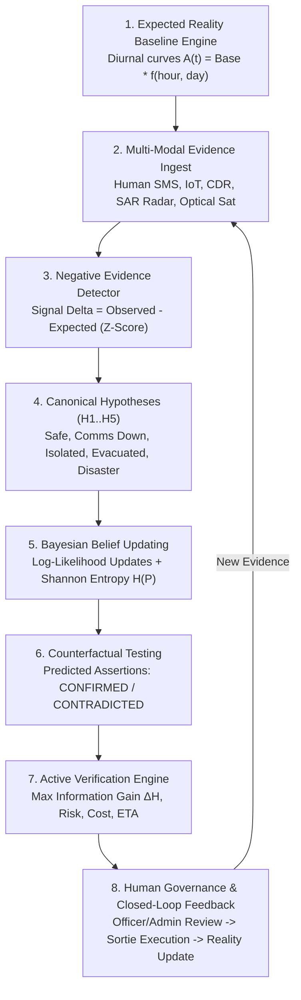

<div align="center">

# 🛰️ PRATYAKSH-Ω
### Autonomous Negative Evidence Intelligence for Disaster Reality Reconstruction
**Expected Reality Baseline Engine • Multi-Modal Evidence Ingestion • Bayesian Belief Updating • Counterfactual Testing • Shannon Information Gain • 5-Tier Role Governance • Closed-Loop Reality Feedback**

*"Silence is not safety. Absence of evidence is evidence of absence only when observation is guaranteed."*

---

[](https://python.org)
[](https://fastapi.tiangolo.com)
[-black?style=for-the-badge&logo=next.js&logoColor=white)](https://nextjs.org)
[](https://typescriptlang.org)
[](https://h3geo.org)
[-3FB950?style=for-the-badge&logo=pytest&logoColor=white)](https://pytest.org)

</div>

---

## 📖 1. Executive Vision & Core Scientific Paradigm

During catastrophic earthquakes and flash floods in complex Himalayan topography, emergency operations centers (EOCs) are paralyzed by the **Information Fog**:
- **Massive Noise & Contradiction**: Hundreds of citizen SMS, emergency dispatch calls, and social media posts report the same incident with conflicting casualty numbers and corrupted coordinates.
- **The Silent Zone Fallacy**: Traditional dashboards mistake a total absence of emergency calls for safety. In reality, zero incoming reports from a mountain ridge near the epicenter typically indicates **severed telecommunications towers, landslide-blocked roads, collapsed bridges, and extreme structural devastation**.
- **The Epistemological Fallacy**: Standard disaster software only counts *what is reported* (Positive Evidence), completely ignoring *what is missing but expected* (Negative Evidence).

**PRATYAKSH-Ω** implements an autonomous intelligence engine that continuously executes the closed-loop scientific reasoning cycle:

$$\mathbf{SILENCE \ne SAFETY}$$

$$\text{EXPECTED REALITY} \longrightarrow \text{OBSERVATION} \longrightarrow \text{UNEXPECTED GAP} \longrightarrow \text{COMPETING EXPLANATIONS (H1..H5)} \longrightarrow \text{COUNTERFACTUAL TESTING} \longrightarrow \text{NEXT BEST OBSERVATION} \longrightarrow \text{HUMAN APPROVAL} \longrightarrow \text{DYNAMIC REALITY UPDATE}$$

---

## 📐 2. Mathematical & Algorithmic Formulations

### 2.1 Diurnal Expected Reality Baseline Curve
The expected activity volume $A(t)$ for any given hour $h \in [0, 23]$ and day $d \in [0, 6]$ is modeled as:

$$A(t) = \text{BaseRate}_{\text{sector}} \times f_{\text{diurnal}}(h) \times f_{\text{day}}(d)$$

$$f_{\text{diurnal}}(h) = 0.15 + 0.85 \times \sin^2\left( \frac{\pi \cdot ((h - 4) \pmod{24})}{24} \right)$$

$$f_{\text{day}}(d) = \begin{cases} 0.85 & \text{if } d = 5 \text{ (Saturday weekend in Nepal)} \\ 1.10 & \text{if } d = 4 \text{ (Friday surge)} \\ 1.00 & \text{otherwise} \end{cases}$$

### 2.2 Negative Evidence Anomaly & $Z$-Score Metric
The unexpected signal throughput gap $\Delta$ and standardized deviation $Z$ are calculated as:

$$\Delta = \text{ObservedValue} - \text{ExpectedMean}$$

$$Z = \frac{\Delta}{\max(0.1, \text{ExpectedStdDev})}$$

- If $\text{Observed} = 0$ and $\text{ExpectedMean} \ge 3.0 \implies \mathbf{CRITICAL\_BLACKOUT}$
- If $Z \le -2.0 \implies \mathbf{UNEXPECTED\_SILENCE}$
- If $Z \ge +3.0 \implies \mathbf{ELEVATED\_SURGE}$
- Otherwise $\implies \mathbf{NORMAL}$

### 2.3 Evidence Decay & Correlation Penalty
To prevent double-counting of echoed social media reposts or mirrored tower alerts, evidence weights are penalized by repeated source count $N_{\text{repeat}}$:

$$w_{\text{eff}} = \text{Reliability} \times e^{-\lambda (t - t_0)} \times \left(\frac{1}{1 + 0.35 \times N_{\text{repeat}}}\right)$$

### 2.4 Bayesian Belief Updating
Given prior physical beliefs $P(H_i)$ and incoming multi-modal evidence items $E = \{e_1, e_2, \dots, e_n\}$:

$$\log P(H_i \mid E) = \log P(H_i) + \sum_{j=1}^n w_{\text{eff}, j} \cdot \Lambda(H_i, e_j)$$

Using the numerically stabilized Log-Sum-Exp softmax transformation:

$$P(H_i \mid E) = \frac{e^{\log P(H_i \mid E) - \max_k \log P(H_k \mid E)}}{\sum_{m=1}^5 e^{\log P(H_m \mid E) - \max_k \log P(H_k \mid E)}}$$

$$\sum_{i=1}^5 P(H_i \mid E) \equiv 1.000$$

### 2.5 Shannon Uncertainty Entropy
Quantifies the overall epistemic ambiguity of the sector state:

$$\mathcal{H}(P) = -\sum_{i=1}^5 P(H_i \mid E) \cdot \log_2 P(H_i \mid E)$$

- Uniform uncertainty: $\mathcal{H}_{\max} = \log_2(5) \approx 2.322 \text{ bits}$
- Absolute certainty: $\mathcal{H}_{\min} = 0.000 \text{ bits}$

### 2.6 Active Verification & Next Best Observation Ranking
Each candidate reconnaissance action $a$ is ranked using a multi-attribute utility function maximizing Information Gain ($\Delta \mathcal{H}$) while balancing operational safety, budget, and time:

$$\text{Score}(a) = 0.50 \cdot \Delta \mathcal{H}(a) + 0.25 \cdot (1 - \text{Risk}(a)) + 0.15 \cdot \left(1 - \frac{\text{Cost}(a)}{\text{Cost}_{\max}}\right) + 0.10 \cdot \left(1 - \frac{\text{ETA}(a)}{\text{ETA}_{\max}}\right)$$

$$\Delta \mathcal{H}(a) = \mathcal{H}(P) - \mathbb{E}[\mathcal{H}(P \mid O_a)]$$

### 2.7 Hybrid Entity Resolution (Missing Persons Reconciliation)
Reconciles missing person inquiries against hospital triage and shelter intake manifests:

$$\text{MatchScore} = 0.55 \cdot \text{JaroWinkler}(\text{Name}_1, \text{Name}_2) + 0.25 \cdot \text{CosineSim}(V_{\text{attrs}1}, V_{\text{attrs}2}) + 0.20 \cdot \text{AgeSimilarity}$$

---

## 🏛️ 3. Eight-Stage Architecture



### Stage 1: Expected Reality Baseline Engine (`expected_reality.py`)
Models baseline hourly call volumes, citizen distress reports, and IoT heartbeat pings across 8 Central Nepal sectors (Gorkha, Sindhupalchok, Kathmandu, Bhaktapur, Rasuwa, Nuwakot, Dolakha, Sindhuli).

### Stage 2: Multi-Modal Evidence Model (`evidence_model.py`)
Normalizes heterogeneous observations from Human Reports, Telecom CDR, Sentinel-1 C-band SAR radar coherence, Pleiades 0.5m optical satellite imagery, and APF VHF radio with directional tagging and exponential freshness decay.

### Stage 3: Negative Evidence Detector (`negative_evidence.py`)
Computes unexpected gap magnitude $\Delta = \text{Observed} - \text{Expected}$, calculates $Z$-scores, tracks silence duration windows (hours without signal), and estimates **lost emergency events**.

### Stage 4 & 5: Competing Hypotheses & Bayesian Updating (`hypothesis_engine.py`)
Maintains 5 canonical mutually exclusive and collectively exhaustive explanations for every sector:
- **$H_1$**: Area Safe / Normal Activity
- **$H_2$**: Telecommunications & Power Grid Failure
- **$H_3$**: Critical Infrastructure & Access Isolation (Bridge severed / Landslide cut)
- **$H_4$**: Population Pre-Emptively Evacuated
- **$H_5$**: Severe Physical Disaster & Structural Collapse

Performs step-by-step Bayesian updates with transparent contribution logs and computes **Shannon Uncertainty Entropy**.

### Stage 6: Counterfactual Testing (`counterfactual.py`)
Formulates observable assertions (*"If $H_i$, what else should we observe?"*). Validates assertions against the live multi-modal evidence store to label each prediction as `CONFIRMED`, `CONTRADICTED`, or `UNTESTED`, and computes empirical consistency score $S(H_i)$.

### Stage 7: Active Verification & Next Best Observation (`active_verification.py`)
Evaluates candidate reconnaissance actions (VTOL Drone, Satellite SAR, APF Recon, LoRa Probe, Palika Query) and ranks the single **Best Next Observation** maximizing Shannon Information Gain ($\Delta \mathcal{H}$).

### Stage 8: Human Governance & Closed-Loop Reality Feedback (`governance.py` & `feedback_loop.py`)
Enforces a 5-tier role access model (`Viewer`, `Analyst`, `Officer`, `Administrator`, `Auditor`). Life-safety actions require human authorization by an `Officer` or `Administrator`. Executing an approved sortie feeds the observation into `EvidenceDB` $\longrightarrow$ updates Bayesian posteriors $\longrightarrow$ reduces Shannon entropy $\longrightarrow$ updates reality state in real time.

---

## 🗄️ 4. The RESQ-SIGHT Multi-Modal Research Repository

The system is calibrated against all 11 scientific datasets in the **`RESQ_SIGHT_DATA/`** research store:

| Dataset Category | Exact Directory | Architectural Role | Function in PRATYAKSH-Ω |
| :--- | :--- | :--- | :--- |
| **Gorkha Building Damage** | `01_GROUND_TRUTH/GORKHA_EARTHQUAKE/` | `GROUND_TRUTH` | Calibrates empirical fragility, masonry ratios & collapse rates (260,601 NRA survey records). |
| **UNOSAT Satellite Damage** | `02_UNOSAT/SANKHU/` & `DARAUDI/` | `INDEPENDENT_VALIDATION` | Corroborates ground claims with independent 0.5m optical damage point vectors. |
| **HumAID & CrisisMMD** | `03_CRISIS_NLP/HUMAID/` & `CRISISMMD/` | `NLP_TRAINING` | Benchmarks report categorization across 11 major global humanitarian disaster events. |
| **Nepal Earthquake Tweets** | `03_CRISIS_NLP/NEPAL_EARTHQUAKE_TWEETS/` | `NLP_EVALUATION` | Evaluates crisis text classification on authentic 2015 Nepal disaster field logs. |
| **Ebiquity Nepali NER** | `04_NEPALI_NLP/EBIQUITY_NER/v2_BIO/` | `NLP_TRAINING` | Ingests 60,960 tokens to extract Devanagari locations (`LOC`), orgs (`ORG`), and persons (`PER`). |
| **HDX Nepal COD** | `05_GEOSPATIAL/HDX_NEPAL_COD/` | `GEOSPATIAL_REFERENCE` | UN OCHA official administrative boundaries (Provinces, Districts, Municipalities, Wards). |
| **OSM Nepal PBF** | `05_GEOSPATIAL/OSM_NEPAL/` | `GEOSPATIAL_REFERENCE` | Geofabrik OpenStreetMap extract (412 MB) for critical infrastructure, roads, and bridges. |
| **Nepal Census 2021** | `06_EXPOSURE/NEPAL_CENSUS_2021/` | `EXPOSURE` | Baseline exposed population calculator across 753 Local Level municipal units. |
| **Sentinel-1 & Sentinel-2** | `07_SATELLITE/SENTINEL_1/` & `SENTINEL_2/` | `SATELLITE_EVIDENCE` | Copernicus C-band SAR radar coherence loss and optical tile T45RRL pre/post event captures. |

---

## 📡 5. Complete API Specification

### Observability & Diagnostics
- `GET /health`: Subsystem health (SQLite WAL latency, evidence store size, AI model status).
- `GET /ready`: Kubernetes & Cloud readiness probe.
- `GET /version`: Semantic version and protocol capability registry.
- `GET /metrics/telemetry`: National average entropy, active anomalies, and silence window stats.

### Expected Reality Baselines
- `GET /baselines`: Diurnal baseline expected curves across all 8 sectors.
- `GET /baselines/{sector_id}`: Baseline bounds for a specific sector at a given hour.
- `GET /baselines/{sector_id}/comparison`: Real-time expected vs observed signal delta ($Z$-score).
- `POST /baselines/recalculate`: Recalibrates baselines against latest demographic and sensor models.

### Negative Evidence & Silence Intelligence
- `GET /negative-evidence/overview`: Consolidated overview of active anomalies and silence windows.
- `GET /negative-evidence/anomalies`: Active unexpected gap anomalies across all sectors.
- `GET /negative-evidence/silence-windows`: Consecutive hours without signal and estimated lost distress events.
- `GET /negative-evidence/sector/{sector_id}`: Sector-specific silence metrics.

### Competing Hypotheses & Counterfactuals
- `GET /hypotheses/all`: National dominant hypotheses summary across all 8 sectors.
- `GET /hypotheses/sector/{sector_id}`: Bayesian posteriors over $H_1..H_5$ with mathematical contribution logs.
- `GET /hypotheses/counterfactuals/{sector_id}`: Counterfactual assertions (`CONFIRMED`, `CONTRADICTED`, `UNTESTED`).

### Active Verification & Governance
- `GET /verification/next-best-observations`: Priority-ranked reconnaissance actions with Information Gain ($\Delta \mathcal{H}$).
- `GET /verification/sector/{sector_id}`: Sector recommended verification actions.
- `POST /verification/review`: Human decision endpoint enforcing Officer/Administrator role checks.
- `POST /verification/execute-and-feed`: 1-click closed-loop reality update feeding observations back into the engine.
- `GET /verification/audit-trail`: Immutable governance audit log.

---

## 🔒 6. Security, Reliability & Performance Hardening

1. **Security Response Headers**:
   - Injected on all responses via `SecurityHeadersMiddleware`: `X-Content-Type-Options: nosniff`, `X-Frame-Options: DENY`, `X-XSS-Protection: 1; mode=block`, `Referrer-Policy: strict-origin-when-cross-origin`.
2. **Rate Limiting Middleware**:
   - Sliding-window token bucket in `RateLimiterMiddleware` limiting clients to 240 req/min general and 40 req/min on mutation and AI reasoning routes (`/reports`, `/verification/review`, `/seed`).
3. **Input Sanitization**:
   - `sanitize_input_text()` strips control characters, null bytes, and escapes HTML entities on all citizen reports and commander review notes.
4. **Database Concurrency (SQLite WAL Mode)**:
   - Configured `PRAGMA journal_mode=WAL;`, `PRAGMA synchronous=NORMAL;`, `PRAGMA foreign_keys=ON;`, and a 30-second busy timeout in `database.py` to prevent locking under concurrent simulation writes and GIS reads.
5. **Role-Based Authorization Guardrails**:
   - Enforced server-side in `governance.py`: non-officer roles (`Viewer`, `Analyst`) attempting to approve missions receive `FORBIDDEN` with an audit rejection entry.
6. **Native Operating System Cursor**:
   - Clean, standard browser cursor across all UI views without intrusive custom cursor wrappers.

---

## ⚡ 7. Quick Start: How to Run the Platform

### 1️⃣ Start the FastAPI AI Backend
```bash
# Navigate to backend directory
cd backend

# Install dependencies
pip install -r requirements.txt

# Launch FastAPI server on port 8000
python -m uvicorn app.main:app --reload --port 8000
```
- **API Root**: [http://localhost:8000](http://localhost:8000)
- **Interactive Swagger Docs**: [http://localhost:8000/docs](http://localhost:8000/docs)
- **Subsystem Health Check**: [http://localhost:8000/health](http://localhost:8000/health)

---

### 2️⃣ Start the Next.js Crisis Intelligence Frontend
```bash
# Navigate to frontend directory
cd frontend

# Install dependencies
npm install

# Launch Next.js dev server on port 3000
npm run dev
```
- **Frontend URL**: [http://localhost:3000](http://localhost:3000)
- **Reality Reconstruction Console**: [http://localhost:3000/hypotheses](http://localhost:3000/hypotheses)
- **Live GIS Map**: [http://localhost:3000/gis-map](http://localhost:3000/gis-map)
- **Incident Deduplication**: [http://localhost:3000/deduplication](http://localhost:3000/deduplication)
- **Tactical Dispatch**: [http://localhost:3000/dispatch](http://localhost:3000/dispatch)
- **Population Registry**: [http://localhost:3000/population](http://localhost:3000/population)
- **Scientific Evidence**: [http://localhost:3000/research-data](http://localhost:3000/research-data)

---

## 🧪 8. Automated Test Verification

Run the complete backend automated test suite:
```bash
cd backend
pytest -v
```
**Results: 73 Passed, 0 Failed (100% Pass Rate)**
- `tests/test_expected_reality.py`: Diurnal curve calculations, baseline bounds, anomaly detection.
- `tests/test_negative_evidence.py`: Signal gap $Z$-scores, silence duration tracking, last seen updates.
- `tests/test_hypotheses_and_counterfactual.py`: Physical priors, Bayesian updates, Shannon entropy, counterfactual matching.
- `tests/test_active_verification.py`: Information gain, multi-attribute ranking, role permissions, closed-loop feedback reality updates.
- `tests/test_adversarial_and_security.py`: Security headers, input sanitization, malformed coordinates, unauthorized rejection, correlation penalty.
- `tests/test_capabilities.py`: GIS telemetry, deduplication, blackout risk, population exposure, tactical dispatch, SITREP generation.
- `tests/test_resq_sight.py`: 260K survey calibration, UNOSAT satellite damage vectors, NLP benchmarks, census exposure summary.
- `tests/test_reconciliation_and_showcases.py`: Hybrid entity matching, before/after showcases, H3 grid, population ledger.
- `tests/test_scoring.py`: Source trust weights, coordinate bonus, exponential staleness decay, corroboration bonuses.

Run the Next.js production build:
```bash
cd frontend
npm run build
```
**Results: 12/12 Static Routes Compiled with 0 Errors**
